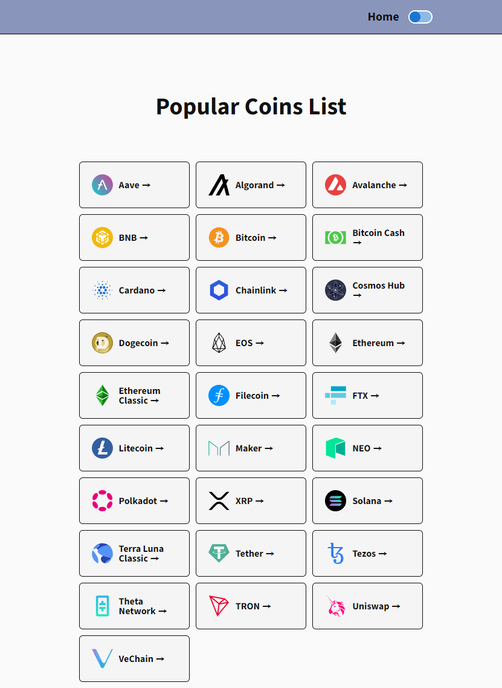
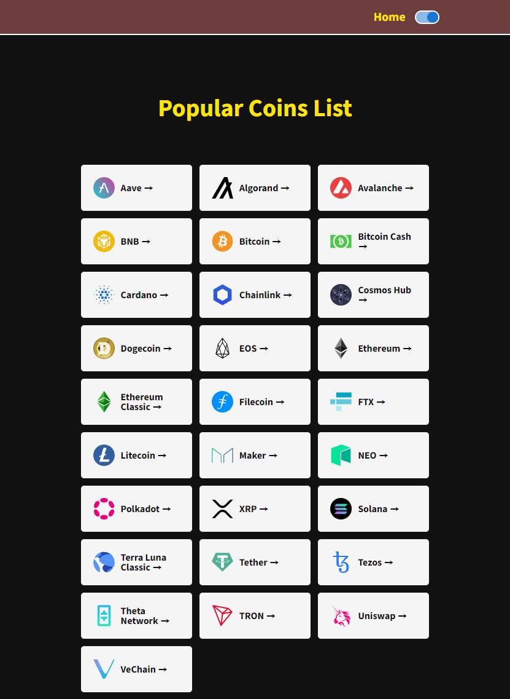
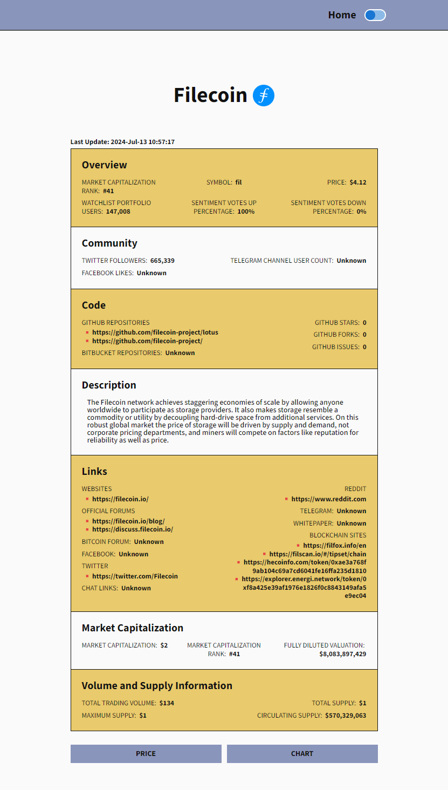

# React Practice Crypto Tracker Assignment

- **One of my personal digital nomad life projects (for practice).**
- **Project current status: [complete]**:ballot_box_with_check:
- **Tech**

  

    &emsp;
    
  

  

    &emsp;
    
    
    
  

  

    &emsp;
    
    
  

<!-- - **Demo: [React Practice Crypto Tracker](https://hansf14.github.io/react-practice-crypto-tracker)**
- **Preview Screenshots**

  

    &emsp;
    
  

  &emsp;
  

    &emsp;
    
  

  &emsp;
  

    &emsp;
    
  

 -->

 
